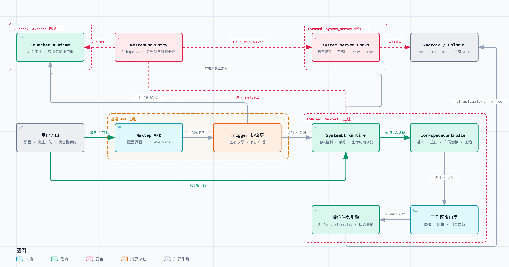

  

<h2 align="center">NeXtep — A Tribute to and Continuation of OneStep</h2>

  <a href="README.md">English</a> / <a href="README_CN.md">中文</a>

  
  
  
  
  
  
  

  &nbsp;
  &nbsp;
  &nbsp;
  &nbsp;
  

# NeXtep

**NeXtep** is an **experimental LSPosed module** that adds a **native side workspace** to ColorOS 16 while keeping the **stock launcher**. It presents **three live task slots**, lets the current app exchange places with a slot, and integrates workspace controls into SystemUI.

The project currently targets a **OnePlus PLK110 running Android 16 / ColorOS 16**. It relies on private Android and ColorOS behavior, so **other devices, ROM versions, and vendor launchers require adaptation**.

## What's new in 0.3.0

- Uses the workspace-facing landscape direction as the default while preserving accelerometer-driven rotation and explicit app orientation requests.
- Clears inherited fullscreen task bounds when leaving the workspace, preventing portrait pages from remaining constrained to the previous landscape area.
- Improves ColorOS tablet and large-screen compatibility for workspace panels, display cutouts, native floating windows, and game-assistant overlays.
- Keeps video tasks usable when moving between the main display and portrait task slots, including recovery from a retained fullscreen player UI.

## Architecture

The diagram below shows how the regular APK process coordinates with the LSPosed-injected SystemUI, Launcher, and system-server processes to provide the workspace and its three task slots.

  

## Features

- **Keeps the stock ColorOS launcher** instead of registering a replacement HOME app.
- **Opens the workspace quickly** from a Quick Settings tile or a top-right status-bar gesture.
- **Shows three live task slots** backed by lifecycle-bound virtual displays.
- **Exchanges tasks** between Display 0 and a selected slot with rollback-aware coordination.
- **Adapts the workspace for landscape video playback** while keeping the control strip and three task slots available, preserving sensor rotation, and restoring fullscreen tasks to system-managed bounds when landscape mode ends.
- **Supports flexible layouts and controls**, including left- and right-side layouts, media controls, wallpaper-backed panels, and configurable app shortcuts.
- **Applies compatibility hooks defensively** and fails open when a supported target cannot be resolved.

## Requirements

- **Android 16 / API 35** or newer
- **ColorOS 16** on a supported device build
- **KernelSU** or another compatible root solution
- **Zygisk and LSPosed** with modern libxposed API support
- The module enabled for the packages listed in `app/src/main/resources/META-INF/xposed/scope.list`

This module modifies **SystemUI, Launcher, and system-server behavior**. **Keep a working recovery path**, and disable the module if the device enters a boot loop or core UI becomes unstable.

## Build

See [docs/BUILDING.md](docs/BUILDING.md) for the required toolchain and build commands.

## Installation

1. Build or obtain the APK.
2. Install it on the target device.
3. Enable NeXtep in LSPosed for every package in the bundled scope list.
4. Reboot the device.
5. Open the NeXtep app to configure the title and app ordering, then add its Quick Settings tile.

## Project status

NeXtep is an **early, device-specific project**. Version 0.3.0 includes compatibility work based on OPPO Pad / ColorOS 16 feedback, but no compatibility promise is made for untested releases or devices. Local recordings, extracted OEM packages, logs, and device dumps used during development are intentionally excluded from the repository.

## License and attribution

NeXtep is licensed under the [Apache License 2.0](LICENSE). See [THIRD_PARTY_NOTICES.md](THIRD_PARTY_NOTICES.md) for third-party attribution and design provenance.

## Acknowledgements

Special thanks to **Smartisan OS OneStep** for the product concept and interaction inspiration behind this project.

Copyright 2026 lujinxin.
