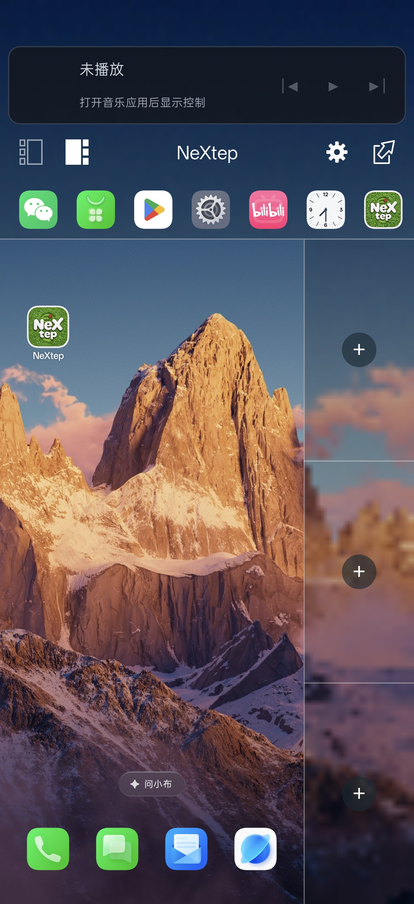
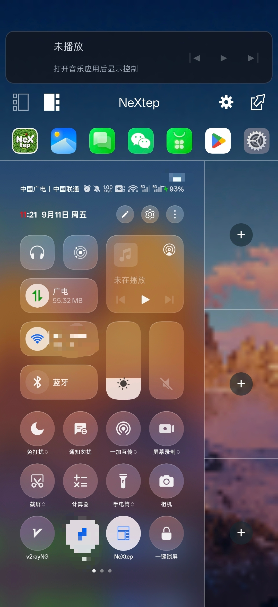
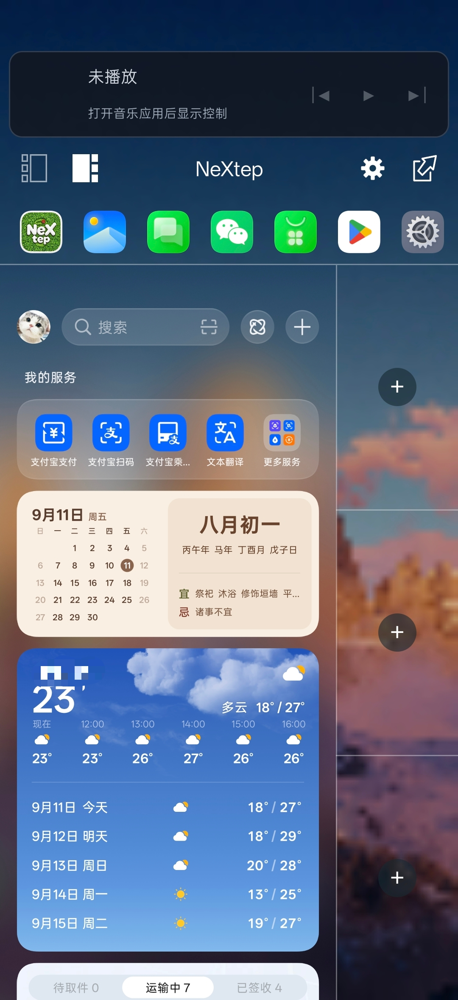
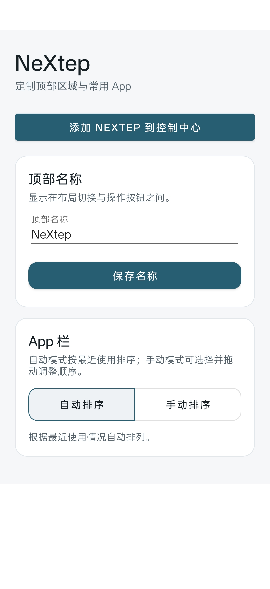
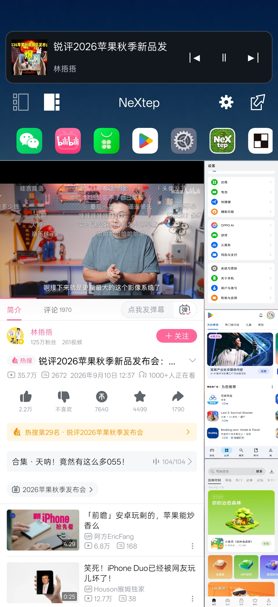

  

<h2 align="center">NeXtep——致敬并延续 OneStep</h2>

  <a href="README.md">English</a> / <a href="README_CN.md">中文</a>

  
  
  
  

  &nbsp;
  &nbsp;
  &nbsp;
  &nbsp;
  

# NeXtep

**NeXtep** 是一个**实验性的 LSPosed 模块**。它在保留 **ColorOS 16 原生桌面**的同时，为系统加入**原生侧边工作区**。工作区提供**三个实时任务槽位**，支持当前应用与槽位交换，并将工作区控制功能集成到 SystemUI 中。

本项目目前以**运行 Android 16 / ColorOS 16 的一加 PLK110** 为目标设备。项目依赖 Android 和 ColorOS 的私有行为，因此**其他设备、系统版本和厂商桌面需要经过适配**。

## 功能

- **保留 ColorOS 原生桌面**，不将 NeXtep 注册为替代的主屏幕应用。
- **快速打开工作区**，可使用快捷设置磁贴或状态栏右上角手势。
- **提供三个实时任务槽位**，由生命周期管理并基于虚拟显示运行。
- **支持任务交换**，可在 Display 0 与所选槽位之间切换，并提供具备回滚能力的协调机制。
- **支持灵活的布局与控制**，包括左右侧布局、媒体控制、壁纸背景面板和可配置的应用快捷方式。
- **以防御方式应用兼容性 Hook**；无法解析受支持目标时，会跳过相应功能以避免影响系统运行。

## 使用要求

- **Android 16 / API 35** 或更高版本
- 受支持设备版本上的 **ColorOS 16**
- **KernelSU** 或其他兼容的 Root 方案
- **Zygisk 和 LSPosed**，并支持新版 libxposed API
- 为 `app/src/main/resources/META-INF/xposed/scope.list` 中列出的所有应用启用本模块

本模块会修改 **SystemUI、桌面和 system server 的行为**。**请确保设备具备可用的恢复手段**；如果设备出现无法开机或核心界面不稳定等问题，请停用本模块。

## 构建

所需工具链和构建命令请参阅 [docs/BUILDING.md](docs/BUILDING.md)。

## 安装

1. 构建或获取 APK。
2. 将 APK 安装到目标设备。
3. 在 LSPosed 中为模块内置作用域列表中的所有应用启用 NeXtep。
4. 重启设备。
5. 打开 NeXtep 应用，设置顶部名称和应用排列方式，然后添加其快捷设置磁贴。

## 项目状态

NeXtep 目前仍是一个**处于早期阶段、针对特定设备开发的项目**。源码中的当前版本为 **`0.1.0`**；对于未经测试的 ColorOS 版本或设备，项目不作兼容性保证。开发过程中使用的本地录屏、提取的厂商应用、日志和设备转储文件均不会包含在仓库中。

## 许可证与署名

NeXtep 使用 [Apache License 2.0](LICENSE) 授权。第三方署名和设计来源请参阅 [THIRD_PARTY_NOTICES.md](THIRD_PARTY_NOTICES.md)。

## 致谢

特别感谢锤子科技 **Smartisan OS OneStep**，为本项目提供了产品理念与交互设计灵感。

Copyright 2026 lujinxin.
