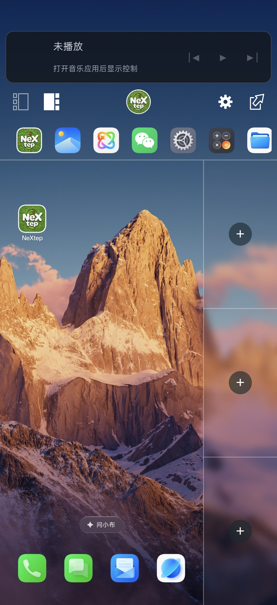
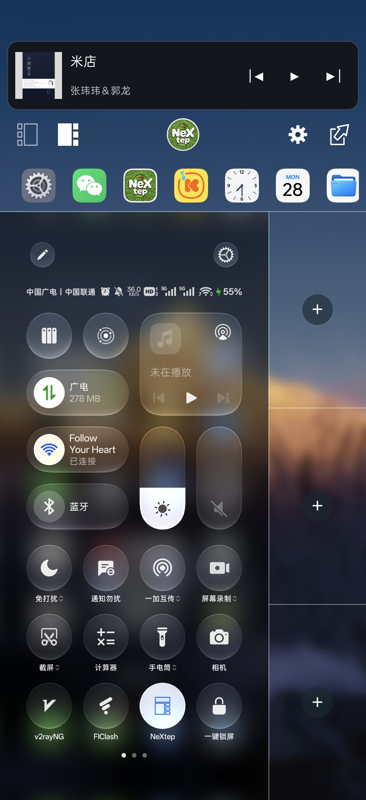
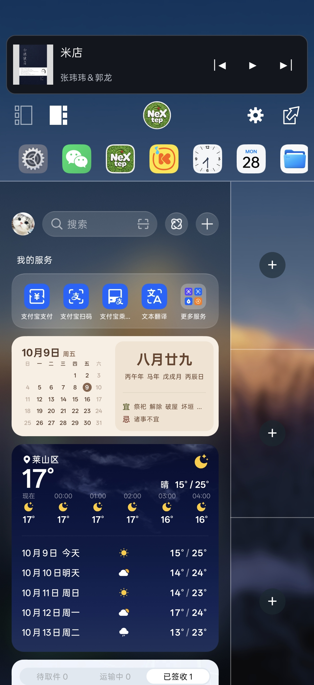
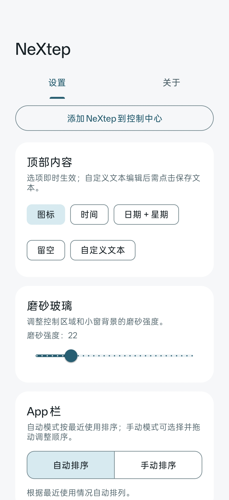
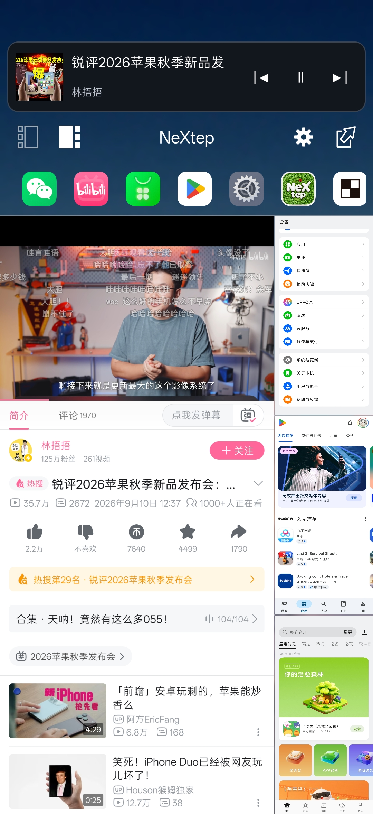
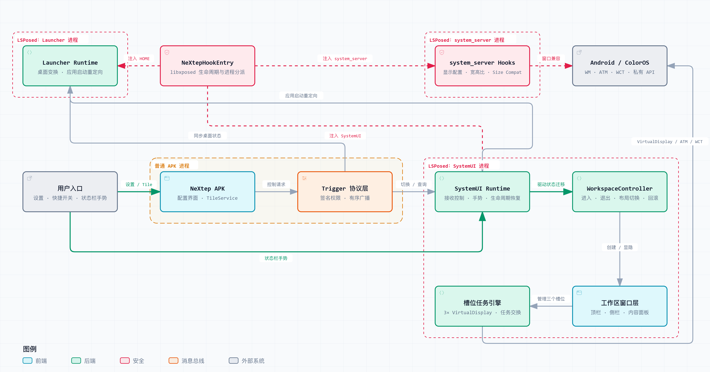

  

<h2 align="center">NeXtep——致敬并延续 OneStep</h2>

  <a href="README.md">English</a> / <a href="README_CN.md">中文</a>

  
  
  
  
  
  
  

  &nbsp;
  &nbsp;
  &nbsp;
  &nbsp;
  

# NeXtep

**NeXtep** 是一个**LSPosed 模块**。它在保留 **ColorOS 16 / 17 原生桌面**的同时，为系统加入**原生侧边工作区**。工作区提供**一个主窗口和三个实时小窗**，支持点击或拖动交换任务、从多任务页添加应用，并将工作区控制功能集成到 SystemUI 中。

本项目主要适配**一加 PLK110**，此前已在 **Android 16 / ColorOS 16** 上验证，最新版功能与兼容性验证基于 **Android 17 / ColorOS 17**。项目依赖 Android 和 ColorOS 的私有行为，因此**其他设备、系统版本和厂商桌面需要经过适配**。

## 演示视频

[在哔哩哔哩观看 NeXtep 演示视频](https://www.bilibili.com/video/BV1iKHj6fEtL)

## 1.1.0 更新内容

- **小窗拖动与交换**：长按小窗可拖到另一槽位或主窗口；支持空槽移动、已占用槽位交换、目标高亮和落位动画，适配竖屏与横屏。
- **拖到控制区移入后台**：出现“松手移到后台”提示后松手，应用会退出槽位并保留在后台，当前主窗口保持原样。顶部应用图标和小窗拖动不再触发 ColorOS 拖放分享面板。
- **从多任务页连续添加应用**：将后台卡片移到屏幕中间，点击空小窗的加号即可加入；添加后保留多任务页，填满第三个槽位也不会主动返回桌面。
- **媒体卡片快速切换**：点击封面、标题等非播放按钮区域可打开播放应用；如果应用已在小窗中，则与主窗口交换。上一首、播放／暂停、下一首继续执行媒体控制。
- **顶部文字滚动与样式**：新增“循环滚动文字”，短文本和长文本均可循环显示；关闭时居中显示，超长部分省略。支持搜索、预览和选择本机系统字体，以及 10–28 sp 字号和粗体。
- **设置界面更新**：新增“设置”和“关于”两页，统一分组与配色，支持浅色和深色；更新检查、发布版本、源码入口和开源协议集中在关于页。
- **ColorOS 17 壁纸与负一屏适配**：修正工作区背景与当前动态壁纸不一致的问题，以及负一屏头像、设置页面重复缩放造成的显示和点击错位。
- **横屏视频回到小窗**：改进全屏视频加入槽位时的退出处理，在已验证的 Bilibili 场景中恢复完整竖屏页面，并保留播放或暂停状态。
- **亮度浮动条定位修复**：修正小窗模式下长按拖动亮度条的偏移，已验证左右侧栏布局、长按亮度面板和退出工作区后的全屏模式。

## 项目架构

下图展示普通 APK 进程如何与经 LSPosed 注入的 SystemUI、桌面和 system server 进程协作，从而提供工作区及其三个任务槽位。

  

## 功能

- **保留 ColorOS 原生桌面**，不将 NeXtep 注册为替代的主屏幕应用。
- **快速打开工作区**，可使用快捷设置磁贴或状态栏右上角手势。
- **提供三个实时任务槽位**，由生命周期管理并基于虚拟显示运行。
- **支持点击与拖动交换任务**，可在主窗口和槽位之间切换，或在两个槽位之间移动、交换应用。
- **从多任务页连续添加应用**，将中间后台卡片加入空槽位，并保持多任务页打开。
- **将小窗移入后台**，拖到控制区即可释放槽位并保留应用任务。
- **适配视频应用横屏播放**，横屏期间保留控制区域和三个任务槽位、继续响应重力感应，并在退出横屏时让全屏任务重新使用系统管理的显示尺寸。
- **支持灵活的布局与控制**，包括左右侧布局、媒体控制、点击媒体卡片打开播放应用、壁纸背景面板和可配置的应用快捷方式。
- **保留符合条件的小窗任务**，支持退出后恢复，并在锁屏解锁期间保留工作区。
- **自定义顶部内容与背景**，支持图标、时钟、日期、留空和文本，以及文字滚动、系统字体、字号、粗体和可调壁纸磨砂强度。
- **与系统原生小窗共存**，原生小窗保持在工作区面板上方。
- **以防御方式应用兼容性 Hook**；无法解析受支持目标时，会跳过相应功能以避免影响系统运行。

## 使用要求

- 验证设备为 **一加 PLK110**；此前使用 **Android 16 / API 36、ColorOS 16**，本轮使用 **Android 17 / API 37、ColorOS 17**（APK 最低安装版本为 API 35）
- 与已适配设备相匹配的 **ColorOS 16 / 17** 系统版本
- **KernelSU** 或其他兼容的 Root 方案
- **Zygisk 和 LSPosed**，并支持新版 libxposed API
- 为 `app/src/main/resources/META-INF/xposed/scope.list` 中列出的所有应用启用本模块

本模块会修改 **SystemUI、桌面和 system server 的行为**。**请确保设备具备可用的恢复手段**；如果设备出现无法开机或核心界面不稳定等问题，请停用本模块。

## 构建

所需工具链和构建命令请参阅 [docs/BUILDING.md](docs/BUILDING.md)。

## 安装

1. 构建或获取 APK。
2. 将 APK 安装到目标设备。
3. 在 LSPosed 中为模块内置作用域列表中的所有应用启用 NeXtep。
4. 重启设备。
5. 在 NeXtep 的“设置”页配置顶部内容、文字样式、磨砂强度和应用排列方式，然后添加其快捷设置磁贴。“关于”页提供版本信息和更新检查。

## 使用方法

启用模块并重启设备后，在解锁状态下，可通过以下两种方式打开或关闭工作区：

- **手势**：从屏幕右上角的状态栏区域水平向左滑动。向下滑动仍然按系统原有方式打开通知栏或控制中心。
- **控制中心开关**：打开 NeXtep 应用，点击 **“添加 NeXtep 到控制中心”** 并确认添加。随后下拉控制中心，点击 **NeXtep** 开关即可切换工作区的开启或关闭状态。如果应用内添加失败，可在控制中心的编辑页面手动添加 NeXtep 开关。

工作区开启后，可按以下方式管理任务：

- **点击小窗**：将其中的应用与当前主窗口交换；当前主窗口为普通应用时，点击空小窗加号可将它放入槽位。
- **从顶部应用栏添加**：长按应用图标，拖到目标槽位后松手。
- **在小窗之间拖动**：长按已有应用的小窗，拖到空槽位时移动，拖到已占用槽位时交换；拖到主窗口则与主窗口交换。
- **移到后台**：将小窗拖到控制区，看到“松手移到后台”后释放；应用任务会保留，当前主窗口不变。
- **从多任务页添加**：打开系统多任务页，将目标卡片移到屏幕中间，再点击空小窗的加号。可连续添加，页面会保持打开；分屏组合卡片需先退出分屏。
- **打开播放应用**：点击媒体卡片的封面或标题。播放应用在槽位中时与主窗口交换，否则打开到主窗口；三个播放控制按钮继续控制媒体。

## 设置说明

- **设置／关于**：设置页调整工作区外观和应用排列；关于页查看版本、检查更新、打开发布页面与项目源码。
- **顶部内容**：选择 NeXtep Icon、时间、日期＋星期、留空或自定义文本，选择后即时生效。显示秒开关位于时间选项右侧。
- **自定义文本**：仅选中此选项时显示输入框和“保存文本”按钮。切换选项会记住输入内容，编辑后点击“保存文本”生效。选择 NeXtep Icon 即可切回默认图标。
- **循环滚动文字**：默认关闭；开启后短文本和长文本均循环滚动，关闭时居中并省略超长部分。工作区隐藏时暂停滚动。
- **字体与字号**：在自定义文本设置中搜索、预览并选择本机系统字体，也可使用通用字体；系统默认跟随手机字体设置。字号范围为 10–28 sp，默认 16 sp，支持粗体，输入框同步预览。
- **磨砂背景**：滑块范围为 0–100，松开后保存并生效，默认 50。仅处理控制区域和小窗背景，App 内容保持清晰。
- **App 栏**：支持按最近使用自动排序，或手动选择和调整快捷方式顺序。

## 项目状态

当前源码版本为 **1.1.0**（`versionCode = 6`）。本轮在**一加 PLK110 的 Android 17 / ColorOS 17** 上验证了核心拖动、后台添加、文字与设置交互，以及壁纸、负一屏、视频回窗和亮度条修复；未覆盖所有应用和边界场景。此前的 Android 16 / ColorOS 16 支持记录保留，其他设备和 ROM 仍需单独适配。

更新通过浏览器下载，不会自动安装。对于未经测试的系统版本或设备，项目不作兼容性保证。开发过程中使用的本地录屏、提取的厂商应用、日志和设备转储文件均不会包含在仓库中。

## 许可证与署名

NeXtep 使用 [Apache License 2.0](LICENSE) 授权。第三方署名和设计来源请参阅 [THIRD_PARTY_NOTICES.md](THIRD_PARTY_NOTICES.md)。

## 致谢

特别感谢锤子科技 **Smartisan OS OneStep**，为本项目提供了产品理念与交互设计灵感。

Copyright 2026 lujinxin.

## 反馈交流群

QQ 群号：**1128561895**

  

